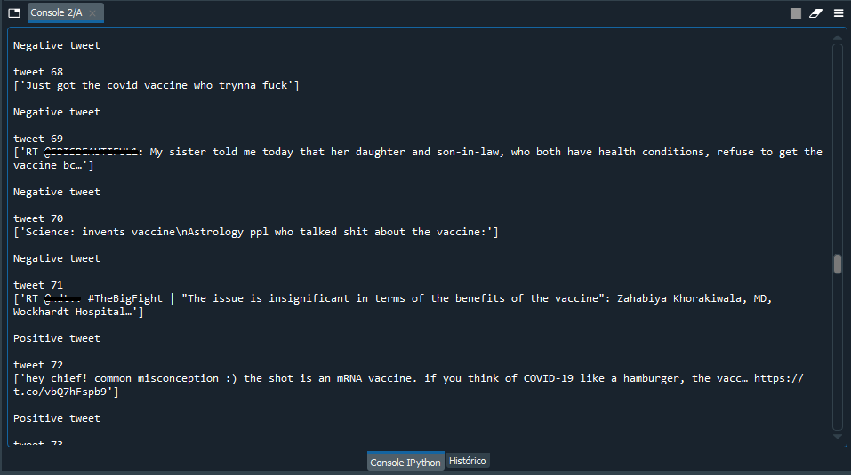
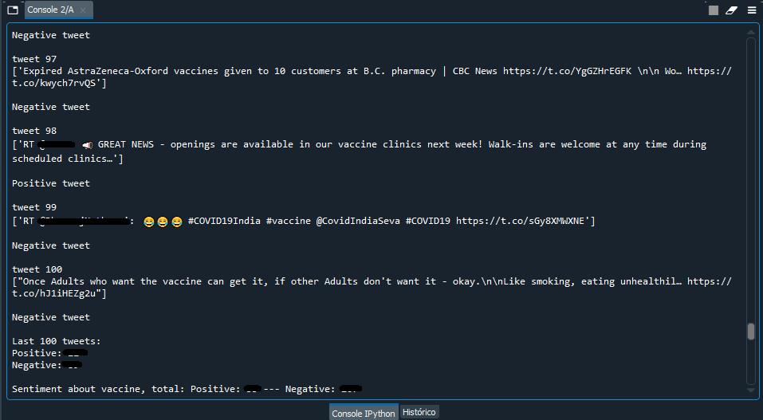

# sentiment-analysis
Real-time sentiment analysis on twitter. 
*For better project exemples in my github, I intend to implement the best practices using OOP and design patterns, solid concepts and examples of asynchronous programming and data structures for performance.

